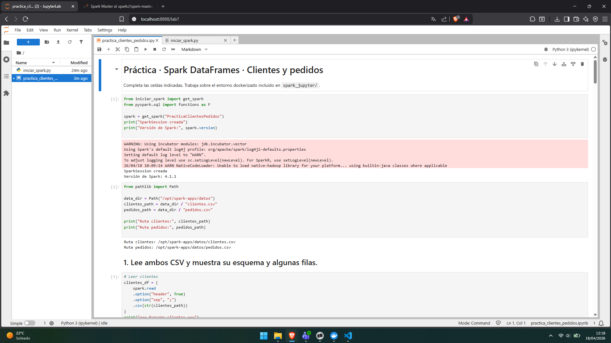
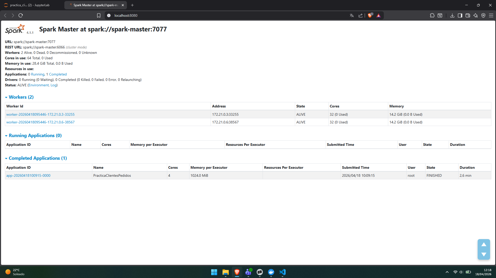
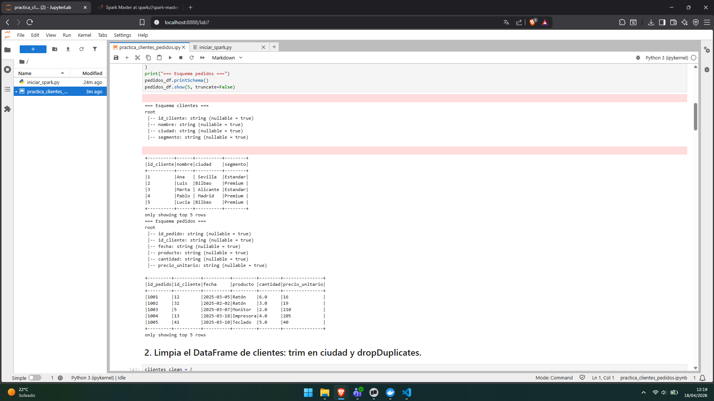
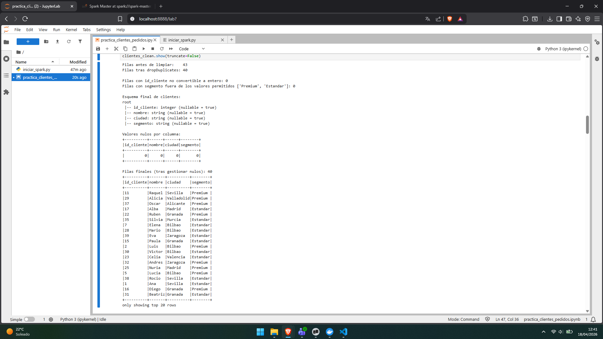
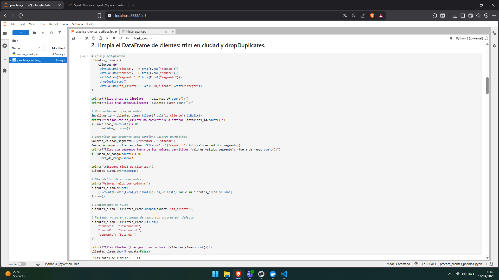
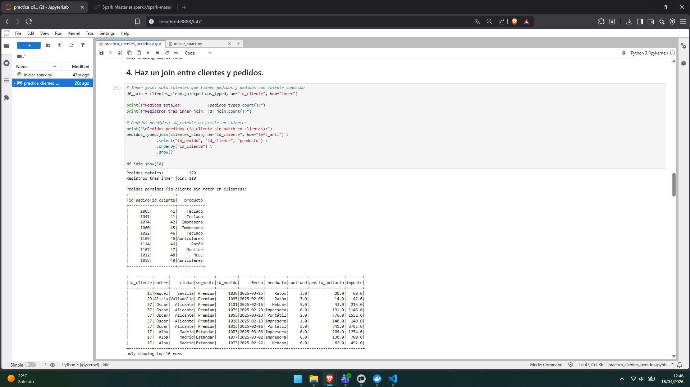
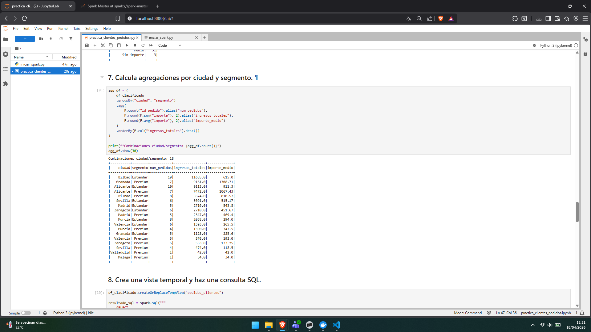
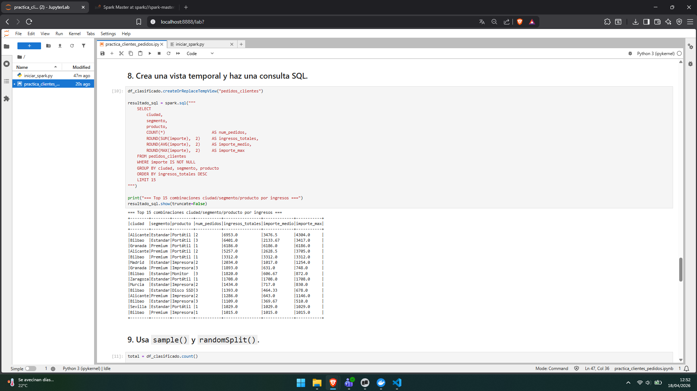
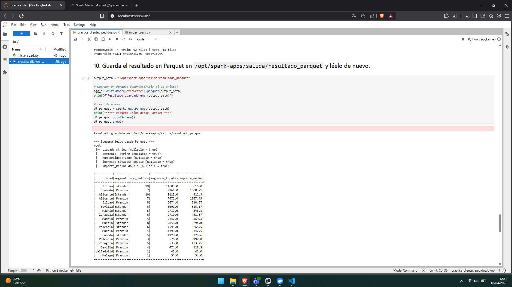

# Evidencias de la práctica

Incluye aquí capturas o salidas relevantes del cuaderno.

## 1. Entorno levantado
- Captura de JupyterLab

- Captura del Spark Master UI

## 2. Lectura de datos
- Esquema de `clientes`
- Esquema de `pedidos`
- Muestra inicial de datos

## 3. Limpieza
- Resultado tras `trim`

- Eliminación de duplicados
- Tratamiento de valores nulos

## 4. Join
- Resultado del join entre clientes y pedidos

- Explicación breve de los registros perdidos

El CSV de clientes solo contiene `id_cliente` del 1 al 40. Sin embargo, el CSV de pedidos tiene pedidos referenciando los clientes 41, 42, 45, 46, 47 y 48, que **no existen en la tabla de clientes** — son clientes huérfanos o datos erróneos.

Un `inner join` solo conserva las filas que tienen correspondencia en **ambos lados**, así que esos 10 pedidos quedan fuera. En total: 120 pedidos originales − 10 sin cliente = **110 registros** en el resultado del join.

Si se quisieran conservar, habría que usar `how="left"` (desde pedidos) y los campos de cliente quedarían como `null` para esas filas.

## 5. Agregaciones
- Resumen por ciudad y segmento

- Interpretación breve de los resultados

El segmento Premium genera ventas de alto importe principalmente a través de productos de ticket elevado (Portátiles), y unas pocas ciudades concentran la mayor parte del volumen económico.

## 6. SQL
- Consulta SQL realizada
- Resultado obtenido

## 7. Parquet
- Escritura del resultado
- Lectura posterior del fichero Parquet

